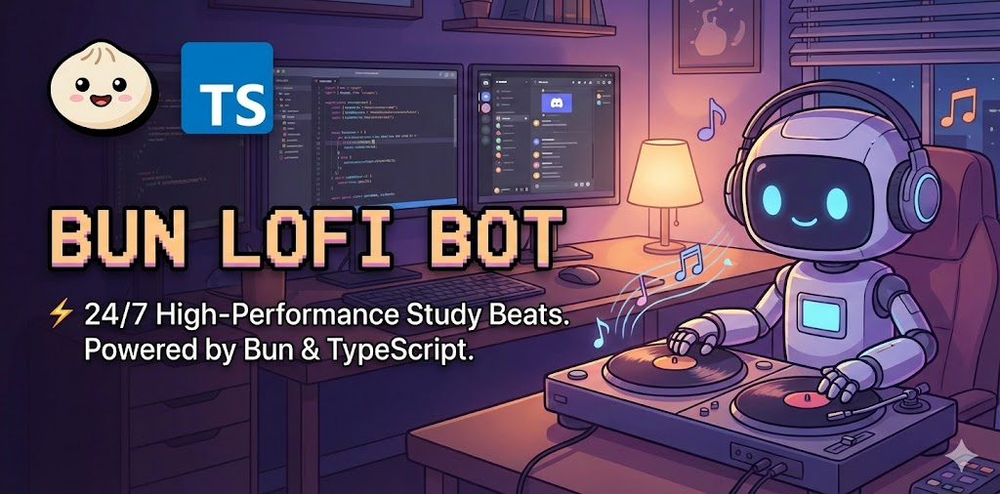

# lofi-bot

A Discord bot that streams radio stations to voice channels. Built with Bun, TypeScript, and PostgreSQL.

## Features

- Stream multiple radio stations to Discord voice channels
- PostgreSQL database for station management
- Auto-reconnection on stream failure
- Multi-server support
- Role-based admin commands

## Quick Start

### Option 1: Docker (Recommended)

```bash
# Set your Discord token
echo "DISCORD_TOKEN=your_token_here" > .env

# Start the bot and database
docker compose up -d

# Check logs
docker compose logs -f bot
```

### Option 2: Local Development

```bash
# Install dependencies
bun install

# Configure environment
cp .env.example .env
# Edit .env with your DISCORD_TOKEN and DATABASE_URL

# Push database schema
bun run db:push

# Start the bot
bun run start
```

## Discord Bot Setup

Follow these steps to create your Discord bot from scratch:

### 1. Create a Discord Application

1. Go to the [Discord Developer Portal](https://discord.com/developers/applications)
2. Click **"New Application"**
3. Enter a name (e.g., "Lofi Bot") and click **Create**

### 2. Create the Bot User

1. In your application, go to the **"Bot"** section in the left sidebar
2. Click **"Add Bot"** and confirm
3. Under the bot's username, click **"Reset Token"** to generate a new token
4. **Copy the token** - this is your `DISCORD_TOKEN` for the `.env` file

> **Warning**: Never share your bot token publicly. If exposed, reset it immediately in the Developer Portal.

### 3. Enable Required Intents

In the **"Bot"** section, scroll to **"Privileged Gateway Intents"** and enable:

- **Message Content Intent** - Required for reading `!` commands

### 4. Generate Invite Link

1. Go to **"OAuth2"** → **"URL Generator"** in the left sidebar
2. Under **"Scopes"**, select:
   - `bot`
3. Under **"Bot Permissions"**, select:
   - **Connect** - Join voice channels
   - **Speak** - Play audio in voice channels
   - **Read Messages/View Channels** - See text channels
   - **Send Messages** - Respond to commands
4. Copy the generated URL at the bottom

### 5. Invite the Bot to Your Server

1. Open the generated URL in your browser
2. Select your server from the dropdown
3. Click **"Authorize"**
4. Complete the CAPTCHA if prompted

The bot should now appear in your server's member list.

### 6. Get Admin Role ID (Optional)

To restrict admin commands (`!addstation`, `!removestation`, `!setdefault`) to specific roles:

1. In Discord, go to **User Settings** → **Advanced** → Enable **Developer Mode**
2. In your server, go to **Server Settings** → **Roles**
3. Right-click on the admin role → **Copy Role ID**
4. Add to your `.env` file: `ADMIN_ROLE_ID=your_role_id`

## Environment Variables

| Variable        | Required | Description                  |
| --------------- | -------- | ---------------------------- |
| `DISCORD_TOKEN` | Yes      | Your Discord bot token       |
| `DATABASE_URL`  | Yes      | PostgreSQL connection string |
| `ADMIN_ROLE_ID` | No       | Role ID for admin commands   |

When using Docker Compose, `DATABASE_URL` is automatically set to connect to the bundled PostgreSQL container.

## Commands

| Command                                  | Description                            | Access   |
| ---------------------------------------- | -------------------------------------- | -------- |
| `!play [station]`                        | Join voice channel and play station    | Everyone |
| `!stop`                                  | Stop streaming and leave voice channel | Everyone |
| `!stations`                              | List all available stations            | Everyone |
| `!addstation <name> <url> [description]` | Add a new station                      | Admin    |
| `!removestation <id>`                    | Remove a station                       | Admin    |
| `!setdefault <id>`                       | Set the default station                | Admin    |

## Development

```bash
# Run with auto-reload
bun run dev

# Lint code
bun run lint
bun run lint:fix

# Format code
bun run format
bun run format:check

# Database commands
bun run db:generate  # Generate migrations
bun run db:push      # Push schema to database
bun run db:studio    # Open Drizzle Studio
```

## Docker Commands

```bash
# Start services
docker compose up -d

# View logs
docker compose logs -f bot
docker compose logs -f db

# Stop services
docker compose down

# Rebuild after code changes
docker compose build
docker compose up -d

# Reset database (destroys data)
docker compose down -v
docker compose up -d
```

## Architecture

See [docs/bot-architecture.md](docs/bot-architecture.md) for detailed architecture documentation.

## License

MIT
